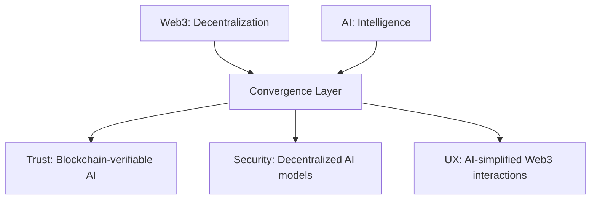

# Web3 vs AI: Disruptive Titans of the Digital Era

The 21st century has been marked by the rise of two transformative forces—**Web3** and **Artificial Intelligence (AI)**.  
Both promise to reshape industries, redefine power structures, and revolutionize how we interact with technology.  
Yet, their journeys and disruption speeds are vastly different.

In this blog, we will explore:
- **How Web3 and AI are disrupting industries**
- **Why AI is moving faster than Web3**
- **Unique strengths and weaknesses of each**
- **Potential convergence and the future they could build together**

---

## **The Disruptive Nature of Web3**

Web3 refers to the **next generation of the internet** built on decentralized technologies like **blockchain, NFTs, DeFi, and DAOs**.  
Its key promise: **users own their data, identity, and digital assets without relying on centralized intermediaries**.

### **Core Components**
- **Blockchain**: The immutable ledger enabling transparency and trust.
- **NFTs (Non-Fungible Tokens)**: Digital proof of ownership for art, music, in-game assets, and more.
- **DeFi (Decentralized Finance)**: Peer-to-peer financial services without traditional banks.
- **DAOs (Decentralized Autonomous Organizations)**: Community-driven governance systems without a central authority.

### **Examples of Impact**
- **Finance**: Protocols like *Uniswap* and *Aave* allow global, permissionless lending and trading.
- **Digital Ownership**: Artists sell NFTs directly to fans, bypassing platforms like Spotify or galleries.
- **Gaming**: Players truly own in-game assets, tradable across marketplaces.

---

## **The Disruptive Nature of AI**

Artificial Intelligence—especially **Generative AI** and **Large Language Models (LLMs)**—is transforming industries at a breathtaking pace.  
Its promise: **machines that can think, learn, and create like humans (or better)**.

### **Core Components**
- **LLMs**: Models like GPT-5 that understand and generate human-like text.
- **Generative AI**: Creates art, music, code, videos, and more.
- **Automation**: Replaces repetitive tasks with intelligent workflows.

### **Examples of Impact**
- **Content Creation**: Tools like *ChatGPT* and *Midjourney* enable instant, high-quality text and visuals.
- **Predictive Analytics**: AI models forecast stock prices, diagnose diseases, and optimize logistics.
- **Customer Support**: AI chatbots provide instant, scalable support to millions.

---

## **Why AI is Disrupting Faster than Web3**

### **1. Easier User Experience**
- AI tools often require **no technical setup**—you can start with just a browser or an app.
- Web3, in contrast, needs wallets, seed phrases, gas fees, and blockchain knowledge.

### **2. Clearer Use Cases**
- AI solves **visible, everyday problems** like writing, designing, and analyzing data.
- Web3’s value proposition often feels **abstract** to non-technical users.

### **3. Lower Regulatory Barriers**
- AI faces fewer legal restrictions—most tools are global from day one.
- Web3 battles **financial regulations, securities laws, and compliance hurdles**.

### **4. Lower Cost of Entry**
- Many AI tools are free or freemium.
- Using Web3 often involves transaction costs.

---

## **Why Web3 Progress is Slower**
- **Complexity**: Requires understanding cryptography, smart contracts, and decentralized infrastructure.
- **Scams & Security Risks**: High-profile hacks and rug pulls undermine trust.
- **Regulatory Uncertainty**: Governments still deciding how to treat crypto assets.
- **Infrastructure Maturity**: Blockchain networks face scalability and speed challenges.

---

## **Unique Potential of Each Technology**

### **Web3 Potential**
- **Data Ownership**: Users control their data rather than platforms monetizing it.
- **Decentralized Finance**: Financial inclusion for the unbanked.
- **Censorship Resistance**: No single point of failure or control.

### **AI Potential**
- **Personalized Assistance**: AI learns your preferences and works like a digital partner.
- **Efficiency Gains**: Massive productivity boosts in research, content, and business.
- **Advanced Predictions**: From weather to healthcare, AI models predict with increasing accuracy.

---

## **Convergence of Web3 and AI**

Imagine combining **AI’s intelligence** with **Web3’s decentralization**:
- AI models stored and run on decentralized networks.
- Verifiable, transparent AI decisions recorded on blockchain.
- AI-powered DAOs that make governance decisions without human bias.

### **Potential Benefits**
- **Enhanced Trust**: Blockchain verifies AI outputs.
- **Better Security**: Decentralized AI models reduce single points of failure.
- **Improved UX**: AI simplifies complex Web3 interactions.

---

## **Visual Representation of AI + Web3 Convergence**

---

## **Conclusion**

Web3 and AI are not competitors—they’re complementary forces.  
While AI’s **speed of disruption** comes from accessibility and instant value, Web3’s **long-term impact** lies in creating a truly fair, user-owned internet.  
When they converge, we may see a digital ecosystem that’s **intelligent, secure, transparent, and user-first**.

The future may not be *AI vs Web3*—it’s more likely to be **AI + Web3**.

